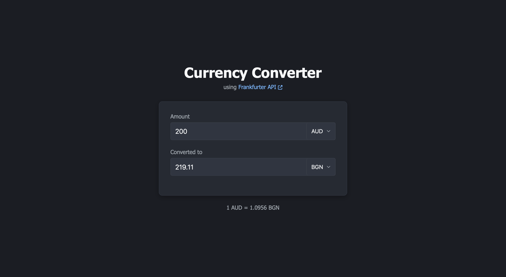

# 💱 Currency Converter

A simple, interactive currency converter web app built with **Flask**, **JavaScript**, and the [Frankfurter API](https://www.frankfurter.app/). Convert between global currencies instantly with up-to-date exchange rates.



---

## 🚀 Features

- Real-time exchange rates via Frankfurter API
- Bi-directional conversion (convert both ways)
- Simple and intuitive UI
- Fully responsive
- Auto-updating exchange rate display

---

## 🛠️ Tech Stack

- **Frontend**: HTML, CSS, JavaScript
- **Backend**: Python (Flask)
- **API**: [Frankfurter](https://www.frankfurter.app/)

---

## 📦 Installation

1. **Clone the repository**
   ```bash
   git clone https://github.com/applejuice8/currency-converter.git
   cd currency-converter
   ```

2. **Set up a virtual environment (optional but recommended)**
   ```bash
   python -m venv venv
   source venv/bin/activate  # On Windows: venv\Scripts\activate
   ```

3. **Install dependencies**
   ```bash
   pip install -r requirements.txt
   ```

4. **Run the Flask app**
   ```bash
   python app.py
   ```

5. **Open your browser**  
   Visit `http://127.0.0.1:5000/` to use the converter.

---

## 📁 Project Structure

```
currency-converter/
│
├── templates/
│   └── base.html
│   └── index.html
│
├── static/
│   └── script.js
│   └── styles.css
│
├── app.py
├── requirements.txt
└── screenshot.png
```

---

## 📄 License

This project is open-source and available under the [MIT License](LICENSE).
